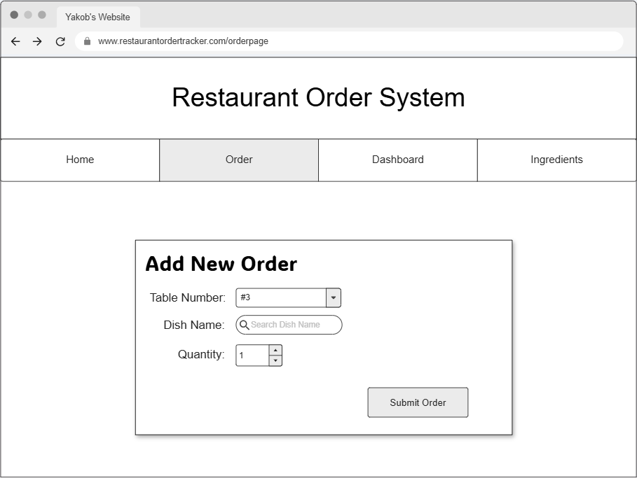
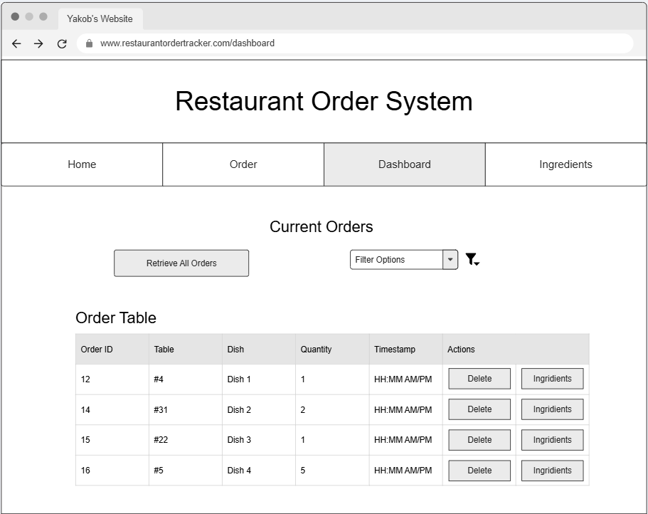

# Yakob's Restaurant Ordering & Ingredient Tracker

## Project Spec

The app will be designed to help waiters, chefs, and kitchen managers keep track of orders in a simple, organized way without relying on paper notes. The general theme is improving restaurant workflow management using a lightweight web application that can streamline communication between the front of house and the kitchen.

The application will consist of three distinct pages, each serving a clear purpose. The first page is the Order Page, which will be used by waiters to enter customer orders. The form will include fields for table numbers, dish name, quantity, and timestamp (automated so no user input). When submitted, the data will be sent to AWS through API Gateway and processed by a Lambda function, which will then store the order in DynamoDB. This page is critical because it represents the “create” functionality in the CRUD cycle, and it ensures that orders are captured digitally and reliably. Waiters will no longer need to rely on handwritten notes, and the kitchen will receive accurate information in real time.

The second page is the Dashboard Page, which acts as the chef’s control panel. This page will allow chefs and managers to retrieve all orders from the database and display them in a table format. Each row will show the order id, table number, dish, quantity, and timestamp, along with action buttons to delete an order or view its ingredients. The dashboard will also include conditional retrieval features, such as filtering orders by dish type, table number, or date. For example, a chef could filter to see only pizza orders for the night, or a manager could check which tables are still waiting for food. The delete functionality ensures that mistakes or canceled orders can be removed quickly, keeping the system clean and accurate.

The third page is the Ingredient Page, which provides a breakdown of the ingredients needed for a specific order. When a chef clicks “View Ingredients” on the dashboard, they will be taken to this page, which will display a list of items required to prepare the dish. For example, if the order is for two burgers, the ingredient page will show two buns, two patties, two slices of cheese, and two lettuce leaves (very generalized example). This page represents the “read” functionality in a more focused way, since it retrieves data for a single order rather than the entire database. It also demonstrates conditional retrieval, as the page only shows the ingredients tied to the selected order. By giving cooks a clear list of what they need, the ingredient page helps streamline kitchen operations and reduces errors.

I am also considering adding a fourth Home Page that would provide useful analytical insights for the restaurant staff. This page could display information such as which tables are currently occupied or available, which dishes are being ordered most frequently, and the rate at which new orders are coming in.

The target audience for this project is restaurant staff, specifically waiters, chefs, and kitchen managers. Waiters will use the order page to submit customer requests, while chefs and cooks will rely on the dashboard and ingredient page to manage and prepare food. The data being managed will include table numbers, dish names, quantities, timestamps, and the ingredients tied to each dish. The website will not be customer facing.

Stretch goals for the project could include adding an analytics dashboard that shows trends such as the most popular dishes or busiest times, or generating a shopping list of ingredients needed for the day. Another possible extension would be an inventory page that tracks what ingredients are currently in stock, allowing chefs to compare available supplies against incoming orders. Accessibility and testing will also be priorities.

In terms of scope and timeline, the project will begin with setting up the GitHub repository and writing the README to describe the plan. The next step will be building the order page and connecting it to AWS, followed by implementing the dashboard with retrieval and deletion functionality. After that, the ingredient page will be added to handle conditional retrieval. Once the core functionality is complete, I will focus on styling each page with CSS, writing tests for JavaScript functions, improving accessibility, and updating other high-level features if needed.

## Project Wireframe

